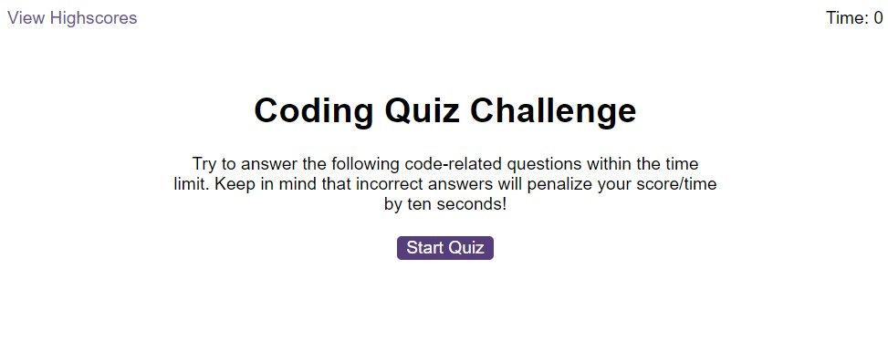
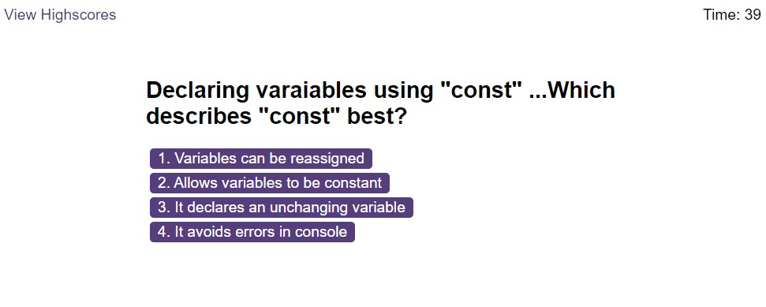
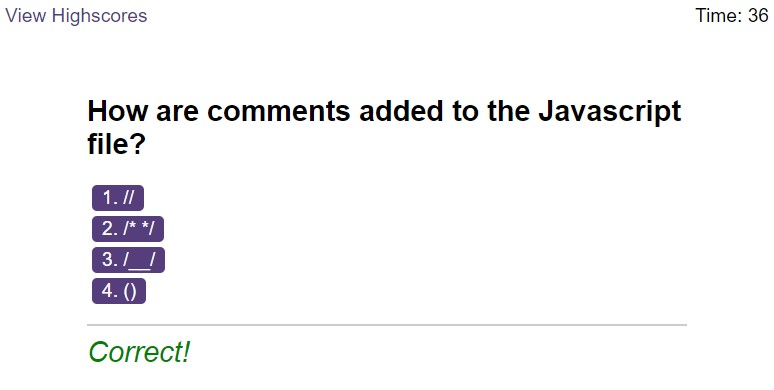
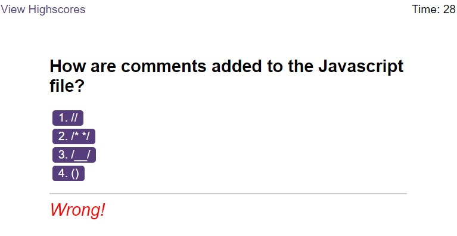
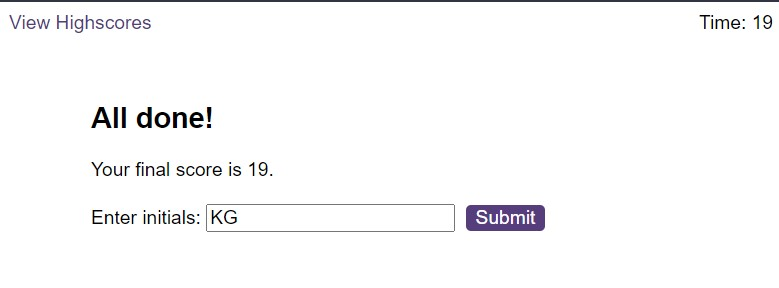
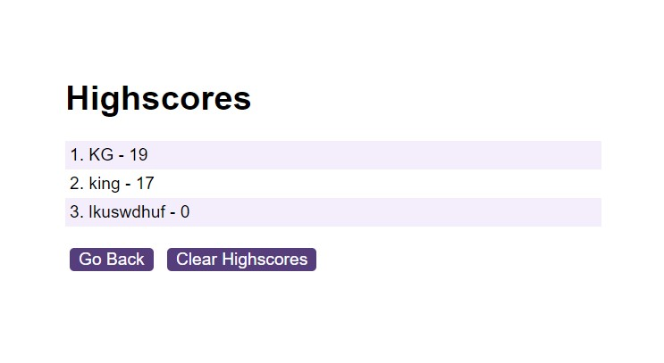

# K88K-Coding-Quiz

# Module 6 Challenge: Coding Quiz

## Requirements

Create a code quiz that contains the following requirements:

* A start button that when clicked a timer starts and the first question appears.
 
  * Questions contain buttons for each answer.
  * 
  * When answer is clicked, the next question appears
  * 
  * If the answer clicked was incorrect then subtract time from the clock

* The quiz should end when all questions are answered or the timer reaches 0.

* When the game ends, it should display their score and give the user the ability to save their initials and their score

## My Work

GitHub link: [K88K-Coding-Quiz](https://github.com/KyloGG88/K88K-Coding-Quiz)

GitPages link: [K88K-Coding-Quiz](https://kylogg88.github.io/K88K-Coding-Quiz/)

Here are screenshots of my work:

Start of Quiz

Clicking the start button begins quiz       

"Correct" feedback 

"Wrong" feedback 

End of Quiz, Time is saved as Highscore & Request for Initials

Score saved to Highscores

Highscores cleared using "Clear Highscores" buttton

# Resources

***Javascript.INFO***
*     https://javascript.info/
***Stack Overflow***
*       https://stackoverflow.com/questions/44314897/javascript-timer-for-a-quiz
***Various Videos - Creating a Quiz in Javascript - YOUTUBE***
*       https://www.youtube.com/watch?v=f4fB9Xg2JEY
*       https://www.youtube.com/watch?v=LQGTb112N_c
*       https://www.youtube.com/watch?v=4piMZDO5IOI